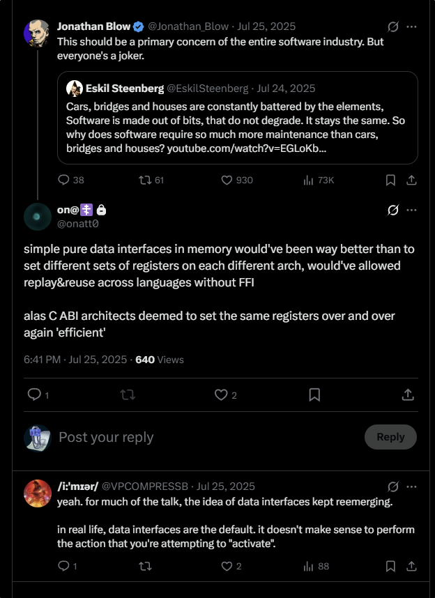

## Source

- URL: https://x.com/onatt0/status/PLACEHOLDER-onatt0-1
- Author: Onat Turkcuoglu (@onatt0)
- Posted: 2025-07-25 18:41
- Note: Account suspended. Transcribed from screenshot provided by the operator on 2026-08-28.

## Branch

**1/** **@onatt0** ^PLACEHOLDER-onatt0-1

simple pure data intemaces in memory would've been way better than to set different sets of registers on each different arch, would've allowed replay&reuse across languages without FFI

## Related

- Spine: [[archive/threads/onatt0/2025-04-30-holy-truthnuke-and-people-think-c-is-the-optimal-state-of]]
