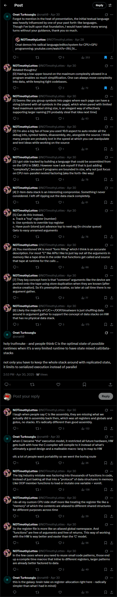

## Source

- URL: https://x.com/onatt0/status/1917656437473399108
- Author: Onat Turkcuoglu (@onatt0)
- Posted: 2025-04-30 14:53
- Note: Account suspended. Transcribed from screenshot provided by the operator on 2026-08-25.

## Branch

**1/**

holy truthnuke - and people think C is the optimal state of possible runtimes when it's a very limited runtime to have state mixed call/data-stacks

not only you have to keep the whole stack around with replicated state, it limits to serialized execution instead of parallel

## Related

- Spine: [[archive/threads/NOTimothyLottes/2025-04-30-3-i-got-side-tracked-by-building-a-language-that]]

## Visible chain (transcribed verbatim from screenshot)

1. **Onat Turkcuoglu** (@onatt0) - Apr 30
   Forgot to mention in the heat of presentation, the initial textual language was heavily influenced by one of your past forth-like languages. Though I've built upon that foundation, I would have taken many wrong turns without your guidance, thank you so much.
   Counts: 1 reply, 5 likes, 253 views, 1 bookmark
   (Quoted tweet below)

2. **NOTimothyLottes** (@NOTimothyLottes) - Apr 28
   Onat demos his radical language/editor/system for CPU+GPU programming: youtube.com/watch?v=I9U_5t...
   Counts: 1 reply, 5 likes, 253 views, 1 bookmark
   (the post Onat quoted)

3. **NOTimothyLottes** (@NOTimothyLottes) - Apr 30
   Related thoughts/
   [0] Having a low upper bound on the maximum complexity allowed in a program enables so much simplification. One can always move complexity into data, while keeping tight codebases.
   Counts: 1 reply, 2 likes, 72 views, 1 bookmark

4. **NOTimothyLottes** (@NOTimothyLottes) - Apr 30
   [1] Seems like you group symbols into pages where each page can have a string (shared with all symbols in the page), which when paired with limited fixed maximum symbol string size, is an elegant way of effectively supporting larger naming [I'll probably steal that idea next time]
   Counts: 2 replies, 1 like, 63 views, 1 bookmark

5. **NOTimothyLottes** (@NOTimothyLottes) - Apr 30
   [2] I'm also a big fan of how you used 16:9 aspect to auto render all the debug info, symbol tables, disassembly, etc, alongside the source. I think many people are probably lost in the speed at which you can manipulate and test ideas while working on the source
   Counts: 0 replies, 0 likes, 51 views, 1 bookmark

6. **NOTimothyLottes** (@NOTimothyLottes) - Apr 30
   [3] I got side tracked by building a language that could be assembled from on the GPU in SIMD. However now I ask myself if that is just adding "complexity", because if programs are bounded in size, why not just focus on CPU non-parallel nested factoring (aka the forth-like way)
   Counts: 2 replies, 1 like, 78 views, 1 bookmark

7. **NOTimothyLottes** (@NOTimothyLottes) - Apr 30
   [4] 2-item data stack is an interesting compromise. Something I never considered. I left off ripping out the data stack completely.
   Counts: 1 reply, 1 like, 61 views, 1 bookmark

8. **NOTimothyLottes** (@NOTimothyLottes) - Apr 30
   [5] Can do this instead.
   a. Track a "top" register (number)
   b. Use symbols to override top register
   c. Have push (store) just advance top to next reg (in circular queue)
   Gets to easy unnamed arguments
   Counts: 2 replies, 3 likes, 78 views, 1 bookmark

9. **NOTimothyLottes** (@NOTimothyLottes) - Apr 30
   [6] You mentioned VK is most "form filling" which I think is an accurate description. For most "C" like APIs I like to just lay out all the arguments in memory like a tape drive in the order that functions get called and source that tape at runtime for the calls ...
   Counts: 1 reply, 1 like, 68 views, 1 bookmark

10. **NOTimothyLottes** (@NOTimothyLottes) - Apr 30
    [7] They key concept here is that "common" arguments like the device are pushed onto the tape using store duplication when they are known (after device creation). So it's preemptive scatter, so later at call time there is no argument gather.
    Counts: 1 reply, 2 likes, 77 views, 1 bookmark

11. **NOTimothyLottes** (@NOTimothyLottes) - Apr 30
    [8] Likely the majority of C/C++/OOP/bloatware is just shuffling data around in argument gather to support the concept of data stacks on HW that has no physical data stack.
    Counts: 2 replies, 1 repost, 3 likes, 175 views, 1 bookmark

12. **Onat Turkcuoglu** (@onatt0) - Apr 30, 2:53 PM, 57 views
    holy truthnuke - and people think C is the optimal state of possible runtimes when it's a very limited runtime to have state mixed call/data-stacks
    not only you have to keep the whole stack around with replicated state, it limits to serialized execution instead of parallel
    Counts: 1 reply, 1 bookmark
    (this is the supplied post 1917656437473399108)

13. **NOTimothyLottes** (@NOTimothyLottes) - Apr 30
    I laugh when people say C is like assembly, they are missing what we actually did in assembly back then, which was all registers and globals and gotos, no stacks. It's radically different than good assembly.
    Counts: 1 reply, 1 repost, 3 likes, 132 views, 1 bookmark

14. **Onat Turkcuoglu** (@onatt0) - Apr 30
    when C became "the" execution model, it restricted all future hardware, HW gets built with how the C compiler will compile to it instead of what's ultimately a good design and a malleable macro-lang to map to HW
    ofc a lot of people want portability so we went the boring route
    Counts: 1 reply, 1 like, 26 views, 1 bookmark

15. **NOTimothyLottes** (@NOTimothyLottes) - Apr 30
    The big industry mistake was factoring into thousands of functions in code, instead of just baking all that into a "protocol" of data structures in memory. Like OOP member functions to load or mutate one variable = vomit.
    Counts: 1 reply, 1 repost, 1 like, 138 views, 1 bookmark

16. **NOTimothyLottes** (@NOTimothyLottes) - Apr 30
    I do all my custom CPU side stuff more like treating the register file like a "memory" of which the contents are aliased to different shared structures for different purposes across time
    Counts: 1 reply, 2 likes, 29 views, 1 bookmark

17. **NOTimothyLottes** (@NOTimothyLottes) - Apr 30
    So the register file is more like an aliased global namespace. And "functions" are free of arguments and free of returns. This way of working with the HW is way better and easier than the 'C' model.
    Counts: 0 likes, 50 views, 1 bookmark

18. **NOTimothyLottes** (@NOTimothyLottes) - Apr 30
    In the few cases where you need to reuse small code patterns, those end up as compile time macros that inline to different registers, larger patterns are already better factored to data
    Counts: 0 likes, 49 views, 1 bookmark

19. **Onat Turkcuoglu** (@onatt0) - Apr 30
    this is the galaxy-brain take on register-allocation right here - radically simpler than what I had in mind)
    Counts: 0 likes, 33 views, 1 bookmark

## Notes

The screenshot's visible chain runs from Onat's quoted Apr-28 NOTimothyLottes
YouTube post through 12 NOTimothyLottes numbered "Related thoughts" replies,
three onatt0 interjections, and four more NOTimothyLottes follow-ups ending in
Onat's "galaxy-brain" reply. Post 12 is the supplied id
`1917656437473399108`. The 11 NOTimothyLottes "Related thoughts" posts sit in
the frozen Lottes thread at
`archive/threads/NOTimothyLottes/2025-04-30-3-i-got-side-tracked-by-building-a-language-that/`
and are not re-keyed into this onatt0 branch. The three onatt0 replies
(including the supplied post) live in this directory.